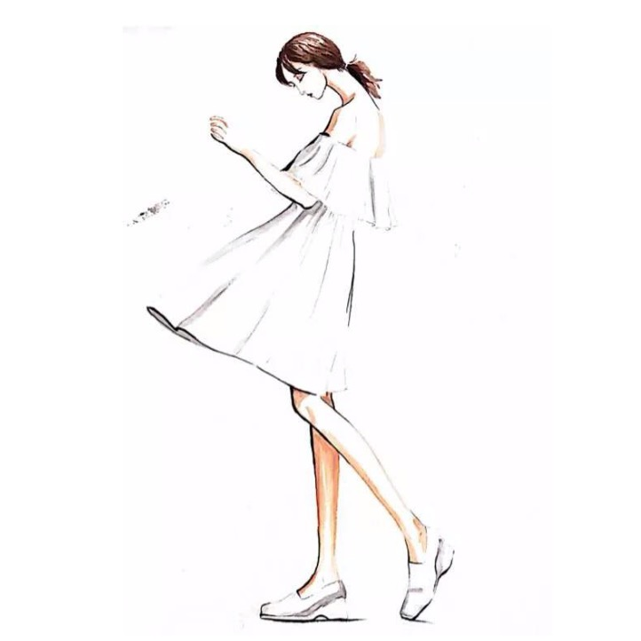

## Welcome to MClothesM

Colors can always express our feelings appropriately.

Pure pigments are elegant and clean,and contrasting colors are full of patterns.

Because of these colors, our world is particularly beautiful.

As the first snow falls, it is quiet and beautiful, like a breeze blowing on the face, it makes people feel heartless,

### Contact us:HymanElijahhSeSl@yahoo.com

Thank you!
